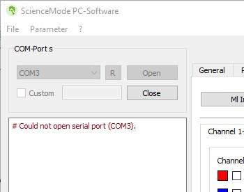
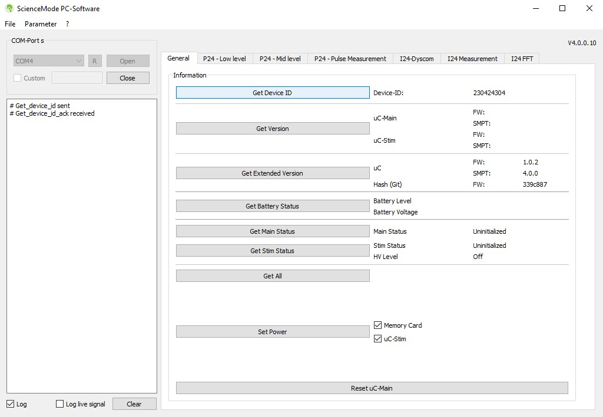
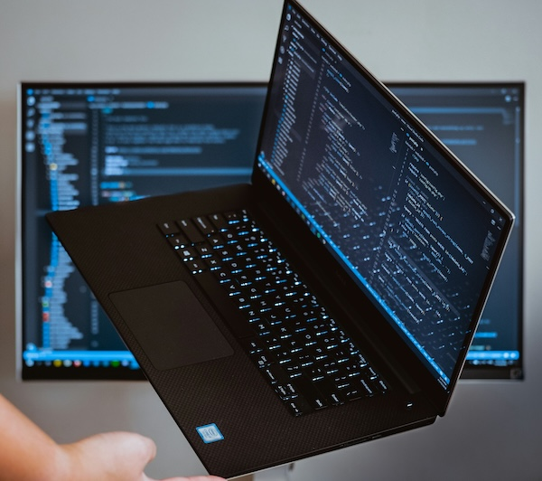

# A Beginner's Guide to Setup a Hasomed P24 Stimulator on a Windows PC


[credit: Christoph Mucke](https://www.linkedin.com/posts/christoph-mucke-a29801b9_p24science-fesresearchapplications-activity-7047189566750904322-Jrnz/?trk=public_profile_like_view)
## Introduction

Installation is relatively complicated and there are plenty of gotchas. There are many dependencies to be installed and sometimes compiled to make sure it all works. This document explains what components are needed and why. I tested this process using a Dell Latitude 5410 laptop running Windows 10 Pro. I am an end-user and not affiliated with Hasomed. 

### Resources

* [ScienceMode4_P24](https://github.com/ScienceMode/ScienceMode4_P24/tree/main): HASOMED's official code base, written in C language.
* [ScienceMode4_python_wrapper](https://github.com/ScienceMode/ScienceMode4_python_wrapper): HASOMED's python wrapper to call the C API, in python. 
* [ScienceMode GUI Software](https://github.com/ScienceMode/ScienceMode_TestSoftware)

## ScienceMode Test GUI Software 

Before working exclusively in the command line to setup the library to build your own software, try connecting to P24 using (HASOMED's diagnostic GUI software)[https://github.com/ScienceMode/ScienceMode_TestSoftware]. But before you do that, you must install FTDI USB drivers if they are not already (they might be already there from Arduino or other microprocessor projects).

### FTDI USB Virtual COM Port drivers (easy!)

1. Download the [FTDI drivers](https://ftdichip.com/drivers/vcp-drivers/)
1. Install using the `.exe` file
1. Reboot the computer


 

If you see an error in the GUI when trying to connect "# Could not open serial port (COM3)" despite physically connecting the P24 to the computer, you most likely need the FTDI drivers. Or they may be another COM port in the drop-down menu to try. 

###
You can send serial commands out with ScienceMode PC Software and receive responses to confirm connections. 



## Prerequisites

Now that you have confirmed USB functionality with two-way communication via a virtual COM port, you are ready to prepare the ScienceMode libraries.  Install the following prerequisite software before moving onto the next stepse. 



### 1. Git for Windows
| | |
|---|---|
|   | Available [here](https://gitforwindows.org), you will use this to clone software repositories from the command line. |

### 2. Python
| | |
|--|--|
|  |Python is used to write software and interact with the P24. Test that [python](https://www.python.org/downloads/windows/) (the highest stable release, e.g. 3.13) is installed, properly linked in [the Windows $PATH environment variable](https://geek-university.com/add-python-to-the-windows-path/), and just works by:

Run the following command in Git bash:
```bash
$ python --V 
```

### 3. mingw-w64
| | |
|--|--|
|  | MinGW is software that allows you to compile code to create Windows apps. It is used in this process. You can install a standalone version of MinGW [here](https://github.com/brechtsanders/winlibs_mingw/releases/download/15.1.0posix-12.0.0-msvcrt-r1/winlibs-x86_64-posix-seh-gcc-15.1.0-mingw-w64msvcrt-12.0.0-r1.zip). It is 256 MB. 

Create an environment variable that the code will use below to access the MinGW library. Click Start > search "edit envi" to open Edit Environment Variables for your account. In the User variables box, choose `New...` and enter:
* Variable name: `MINGW_PATH` 
* Variable value: [the location of the `mingw64` folder, can browse to it with `Browse Directory...` button]. 

Note: Do not include the /bin/ folder at the end of the path or setup.py will not find cpp.exe and will break!
Hit Ok, then Ok.

Alternatively, you can hard code the path in `ScienceMode4_python_wrapper\sciencemode\_cffi.py` near line 201.

### 4. Visual Studio Compiler in Microsoft C++ Build Tools

| | |
|-|-|
|| Find the installer at [Microsoft.com](https://visualstudio.microsoft.com/visual-cpp-build-tools/). You only need the "Visual Studio Build Tools 2022", which is 6GB. You could download everything for almost 30GB but they are not used in this project.

### 5. Anaconda Navigator
| | |
|-|-|
|| Download [here](https://www.anaconda.com/download). Installing this gives you access to `conda` which is used to create the pyScienceMode environment later on. 

Pay attention to the installation path when you are installing it. If you choose install for "All Users", it will not add `conda` to the $PATH and you will have to do it manually. In Windows 10, the default path to the commands is `C:\ProgramData\anaconda3\Scripts`

``` 
$ conda --version 
```
If the above command returns an error, then you need to add to $PATH variable. Click Start > search "edit envi" to open Edit Environment Variables for your account. In the User variables box, click `Edit...` on the Path row, then create a new row with the anaconda scripts directory. Then Ok, Ok, and restart the terminal for it to take effect.

### Folder organization
I create a `projects` folder where I clone all the repositories to stay organized. Navigate to your `projects` folder to clone the repositories in the next sections. 

## Build the ScienceMode4 library

This library is the official software from Hasomed that allows one to use the P24.

### Clone repository

In a Git Bash window, run
```bash
~projects/ $ git clone https://github.com/ScienceMode/ScienceMode4_python_wrapper.git
```

The `smpt` folder is a git submodule, so its contents have to be cloned separately in order to build the wheel below. Run: 

```bash
~projects/ $ cd ScienceMode4_python_wrapper
~ScienceMode4_python_wrapper/ $ git submodule init
~ScienceMode4_python_wrapper/ $ git submodule update
```


### Get the smpt library file
1. Next, download [smpt_windows_static_x86.zip](https://github.com/ScienceMode/ScienceMode4_c_library/releases/download/v4.0.0/smpt_windows_static_x86.zip) from the ScienceMode4_c_library. The zip file is buried in the ["Release 4.0.0" tag](https://github.com/ScienceMode/ScienceMode4_c_library/releases/tag/v4.0.0) but you can download it directly by the link. You can save and extract this wherever, because you will copy a file into the repository next. 

1. Find the `libsmpt.lib` file in the extracted zip file deep in this tree: 

` smpt_windows_static_x86\ScienceMode_Library\release\smpt\windows_x86\static\libsmpt.lib`

1. Copy `libsmpt.lib` into the `ScienceMode4_python_wrapper\lib\` folder in the newly downloaded repository.

### Install dependencies

It is good practice to install packages in a virtual environment when working in python projects. That way each project has its own version of a package, so it will not break if it is using a global package that gets upgraded by another process. Using a virtual environment is a multi-step process. `Venv` is a commonly used virtual environment system, but since pyScienceMode requires conda environment we will use conda envs throughout.  

### Setup a conda environment with python 3.10 and install numpy package
The wheel requires version `3.10` and will fail with any other version. 

```bash
ScienceMode4_python_wrapper/ $ conda create --name cenv python=3.10
ScienceMode4_python_wrapper/ $ conda init
ScienceMode4_python_wrapper/ $ conda activate cenv
```

If you see an error:
```bash
`CondaError: Run 'conda init' before 'conda activate' 
```

then you have to manually enable conda in Git Bash on Windows.  In the bash prompt, run

```bash
$ nano ~/.bashrc
```
Add the following block at the bottom, replacing the right path to `anaconda3`
```bash
# >>> manual conda init >>>
CONDA_BASE="/c/ProgramData/anaconda3"
source "$CONDA_BASE/etc/profile.d/conda.sh"
# <<< manual conda init <<<
```
In nano, type `Ctrl+O` then `Ctrl+X` to save and exit.  Then run 

```bash
$ source ~/.bashrc
$ conda activate cenv
```

Once in a virtual environment denoted by the bash prompt starting with `(cenv)`, install the dependencies with `pip` (Pip Installs Packages). FYI `setuptools` is used to help developers build packages and `wheel` creates simplified packages for distributing. Run the following lines: 

```bash
(cenv) ScienceMode4_python_wrapper/ $ conda install pip
(cenv) ScienceMode4_python_wrapper/ $ pip install setuptools wheel 
(cenv) ScienceMode4_python_wrapper/ $ python setup.py bdist_wheel --universal
```

## Install the pyScienceMode interface

[pyScienceMode](https://pysciencemode.readthedocs.io/en/latest) is a high level layer that uses the ScienceMode4 library. Do not attempt to jump here until `ScienceMode4_python_wrapper` is successfully installed.  

### Setup the repository
Navigate to your projects folder, outside of the `ScienceMode4_python_wrapper` repository and clone. 

```bash
projects/ $ git clone git@github.com:s2mLab/pyScienceMode.git
```
Activate the conda environment `cenv` made earlier if it you do not see `(cenv)` in the bash prompt.

```bash
$ source ~/.bashrc
$ conda activate cenv
```

### Install the program

```bash
(cenv) projects/ $ cd pyScienceMode
(cenv) pyScienceMode/ $ python setup.py install

(cenv) pyScienceMode/ $ pip install sciencemode_cffi-1.0.0-cp310-cp310-win_amd64.whl
(cenv) pyScienceMode/ $ pip install crccheck colorama pyserial typing pysciencemode
(cenv) pyScienceMode/ $ conda install -c conda-forge numpy
```

### Try out the pyScienceMode and ScienceMode examples!

```bash
(cenv) pyScienceMode/ $ cd Examples
(cenv) pyScienceMode/ $ python rehastimp24_example.py
```